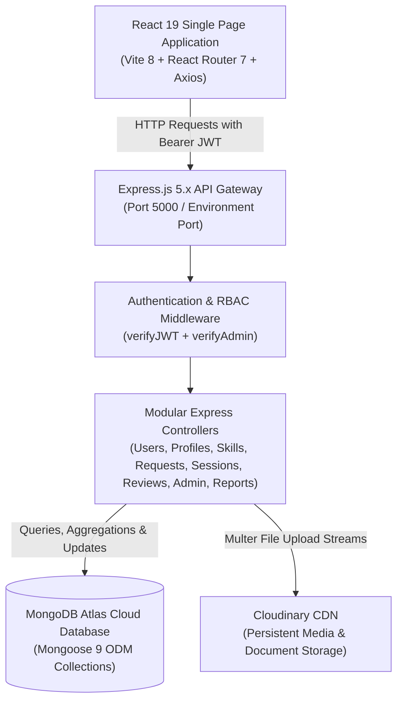

# SkillBridge

> **Student Skill Exchange & Peer Collaboration Platform**  
> Department of Computer Engineering, Faculty of Technology, Dharmsinh Desai University (DDU)

SkillBridge is a centralized, role-based peer learning and mentorship web application designed specifically for university campuses. It replaces scattered, informal communication channels (like unorganized WhatsApp groups and word-of-mouth requests) with an organized, verifiable, and metric-driven collaboration platform.

---

## Table of Contents

- [Problem Statement](#problem-statement)
- [Solution Overview](#solution-overview)
- [Key Features by Role](#key-features-by-role)
  - [Student (Learner)](#1-student-learner)
  - [Mentor](#2-mentor)
  - [Administrator](#3-administrator)
- [End-to-End System Workflow](#end-to-end-system-workflow)
- [System Architecture](#system-architecture)
- [Technology Stack](#technology-stack)
- [Database Models & Schema Design](#database-models--schema-design)
- [Complete REST API Reference](#complete-rest-api-reference)
- [Project Directory Structure](#project-directory-structure)
- [Installation & Local Setup Guide](#installation--local-setup-guide)
- [Pre-Configured Demo Credentials](#pre-configured-demo-credentials)
- [Testing & Quality Assurance](#testing--quality-assurance)
- [Future Extensions](#future-extensions)
- [Project Credits](#project-credits)

---

## Problem Statement

In academic environments, learning from senior or experienced peers is one of the fastest ways to build practical engineering skills (such as React, Python, Data Structures, and Cloud deployment). However, campus peer learning faces four major bottlenecks:

1. **Lack of Skill Discoverability:** There is no verified, searchable index showing which student excels in which specific domain or technology.
2. **Buried Communication:** Help requests posted in large WhatsApp or Telegram groups get buried under unrelated messages within minutes.
3. **No Accountability or Quality Metrics:** Learners have no objective reviews, ratings, or feedback to evaluate a mentor's teaching credibility.
4. **Uncoordinated Scheduling:** Coordinating meeting dates and times informally leads to scheduling conflicts, overlapping sessions, and double-booking.

---

## Solution Overview

SkillBridge eliminates these challenges by providing:

- **Institutional Safety:** Enforces official college email verification (`@ddu.ac.in`) and administrator account audits.
- **Categorized Skill Catalogs:** Standardized proficiency levels (`Beginner`, `Intermediate`, `Advanced`).
- **Parametric Mentor Search:** Multi-parameter filtering by skill keyword, department, year, and minimum rating.
- **Formal Request State Machine:** Managed lifecycle transitions (`Pending` -> `Accepted` / `Rejected` -> `Cancelled`).
- **Conflict-Free Scheduling:** Automated slot-collision engine that prevents double-booking active mentor time slots.
- **Fair Reputation System:** Post-session ratings (1.0 to 5.0 stars) automatically recalculate mentor average scores to power the university leaderboard.
- **Administrative Governance:** Complete institutional control to verify students, moderate misconduct reports, and monitor platform engagement analytics.

---

## Key Features by Role

### 1. Student (Learner)
- **Institutional Registration:** Secure sign-up requiring an official college email (`@ddu.ac.in`) with profile picture upload.
- **Parametric Discovery:** Search peers by technical skill keyword, department, academic year, and minimum rating threshold.
- **Top Mentors View:** Quickly identify top-rated peers on campus sorted by verified student reviews.
- **Mentorship Requests:** Dispatch formal learning requests with personal learning objectives and notes.
- **Session Coordination:** Book 1-on-1 sessions (Online or In-Person), reschedule meeting times, or cancel sessions with automatic notification.
- **Ratings & Reviews:** Rate mentors upon session completion to contribute to the university reputation score.
- **In-App Notifications:** Real-time status alerts for request acceptances, rejections, and schedule modifications.

### 2. Mentor
- **Skill Inventory Management:** Add, update, or remove technical skills categorized under domains (Web Development, Backend, AI/ML, Core CS).
- **Profile & Credential Showcase:** Maintain bio, weekly availability schedule, portfolio link, and Cloudinary-stored resume/certificates.
- **Request Triage:** Review incoming student mentorship requests; accept or reject with a single click.
- **Conflict Prevention:** System automatically blocks double-booking if another student tries to schedule the same time slot.
- **Reputation Tracking:** View received ratings and student testimonial feedback driving their campus rank.

### 3. Administrator
- **Student Verification:** Audit newly registered students and approve verified academic accounts.
- **User Moderation:** Suspend or reactivate user accounts violating campus code-of-conduct guidelines.
- **Community Grievance Resolution:** Review reports submitted by students against abusive behavior or content; dismiss or execute account suspension.
- **Platform Analytics Engine:** Real-time visibility into registered users, active vs. suspended counts, most demanded skills, and session completion metrics.

---

## End-to-End System Workflow

SkillBridge coordinates the complete lifecycle of peer collaboration across 6 distinct phases:

### Phase 1: Authentication & Verification
1. The student or mentor registers with their name, password, department, academic year, and an official `@ddu.ac.in` college email.
2. The password is encrypted using 10-round salted Bcrypt hashing.
3. The user account is created with `isVerified: false`.
4. The institutional Administrator inspects pending accounts on the Admin Dashboard and approves verification.

### Phase 2: Profile & Skill Cataloging
1. The mentor navigates to their profile and sets their weekly availability schedule and bio.
2. The mentor adds technical competencies under standard categories with explicit proficiency levels.
3. Uploaded resumes and certificates are processed via Multer disk storage and streamed to Cloudinary CDN for persistent hosting.

### Phase 3: Mentor Discovery & Search Filtering
1. The learner visits the Find Mentors catalog.
2. The client calls `GET /api/v1/mentors` with query parameters.
3. The learner filters by skill keyword (e.g. *React*), department (*Computer Engineering*), and minimum rating (*4.0+ Stars*).
4. The learner can toggle the Top Mentors filter to rank mentors descending by their arithmetic rating.

### Phase 4: Mentorship Request Lifecycle
1. The student opens the mentor's profile and submits a learning request selecting a specific skill with an introductory note.
2. **Business Guard 1 (Self-Request Guard):** The backend verifies `studentId !== mentorId`. A user cannot request mentorship from themselves.
3. **Business Guard 2 (Duplicate Request Guard):** The server checks if an identical pending request already exists for the same skill and mentor. If found, it returns `HTTP 409 Conflict`.
4. The request is created with `status: 'pending'`, and an in-app notification is dispatched to the mentor.
5. The mentor reviews the request in their dashboard and clicks **Accept** (status transitions to `accepted`) or **Reject** (status transitions to `rejected`).

### Phase 5: Session Scheduling & Conflict Detection
1. Once accepted, the student or mentor clicks **Schedule Session** linked to the accepted request.
2. They select the date, time, and session format (`Online` or `Offline`).
3. **Business Guard 3 (Past-Date Guard):** The server ensures the selected date and time are in the future.
4. **Business Guard 4 (Double-Booking Conflict Guard):** The backend queries the `Sessions` collection to verify whether the mentor already has an active session scheduled at that exact time slot. If an overlap is detected, the server aborts the transaction with `HTTP 409 Conflict`.
5. Participants can reschedule the session to a new slot with updated validation.
6. Once conducted, either participant clicks **Mark Completed** (`status: 'completed'`).

### Phase 6: Review & Dynamic Rating Recalculation
1. Once the session is marked completed, the student's review button unlocks.
2. **Business Guard 5 (Completed Session Requirement):** The server blocks reviews for uncompleted or scheduled sessions with `HTTP 400 Bad Request`.
3. The student submits a score (1.0 to 5.0 stars) and feedback.
4. The backend stores the new review and recalculates the mentor's arithmetic mean rating:
   `averageRating = (Sum of all review scores) / (Total review count)`
5. The mentor's profile document is updated and saved in MongoDB, immediately reflecting on the public mentor catalog.

### Phase 7: Administrative Governance & Platform Analytics
1. Any user can report inappropriate conduct or harassment via `POST /api/v1/reports`.
2. The Administrator inspects the grievance on the Admin Moderation Dashboard.
3. The Administrator can dismiss unfounded reports or suspend the reported account (`accountStatus: 'suspended'`).
4. Suspended accounts are immediately blocked from logging in with `HTTP 403 Forbidden`.
5. The Administrator inspects platform analytics (`GET /api/v1/analytics/activity`) to track user growth, high-demand skills, and total completed sessions across the university.

---

## System Architecture

SkillBridge adopts a decoupled client-server architecture following REST principles:



---

## Technology Stack

| Category | Technology | Version | Purpose & Architectural Role |
| :--- | :--- | :--- | :--- |
| **Frontend Framework** | React.js | 19.x | Component-based client interface with reactive state |
| **Frontend Tooling** | Vite | 8.x | High-speed build engine with Hot Module Replacement |
| **Client Routing** | React Router DOM | 7.x | Declarative routing with protected role-based guards |
| **HTTP Client** | Axios | 1.20.x | Promise-based API invocations with automatic request/response interceptors |
| **Backend Runtime** | Node.js | 22.x LTS | Asynchronous, event-driven runtime environment |
| **Backend Framework** | Express.js | 5.x | Minimalist RESTful routing and middleware engine |
| **Database** | MongoDB Atlas | Cloud | Distributed NoSQL document database |
| **ODM Modeling** | Mongoose | 9.x | Strict schema validation, relations via ObjectId, and indexing |
| **Authentication** | JSON Web Tokens (JWT) | 9.x | Dual-token security architecture (Access Token + Refresh Token) |
| **Password Hashing** | Bcrypt | 6.x | 10-round salted one-way cryptographic password hashing |
| **Media Storage** | Cloudinary SDK | 2.x | Cloud storage for profile avatars, resumes, and certificates |
| **Multipart Parsing** | Multer | 2.x | File stream handling with temporary disk cleanup |
| **Process Runner** | Concurrently | 10.x | Unified execution of both client and server development processes |

---

## Database Models & Schema Design

Data integrity is maintained using Mongoose schemas and relational `ObjectId` references across 8 primary collections:

```
Users (1) ────────── (1) Profiles (1) ────────── (N) Skills
  │                        │
  │ (1:N)                  │ (1:N)
  ▼                        ▼
Notifications        LearningRequests (1) ────── (1) Sessions (1) ────── (1) Reviews
                           │
                           ▼
                        Reports
```

- **Users Collection:**
  - `_id`: Unique user identifier (ObjectId)
  - `name`: Full legal student name (String, required)
  - `email`: College email ending with `@ddu.ac.in` (String, unique, lowercase)
  - `password`: Salted Bcrypt hash (String, required)
  - `department`: Academic branch e.g. CE, IT, EC (String, required)
  - `academicYear`: Current year of study 1 to 4 (Number, required)
  - `role`: Access role enum (`Student`, `Mentor`, `Administrator`)
  - `profilePicture`: Secure Cloudinary image URL (String)
  - `isVerified`: Institutional verification flag (Boolean, default: false)
  - `accountStatus`: Account state enum (`active`, `suspended`)
  - `refreshToken`: Stored session refresh token (String)

- **Profiles Collection:**
  - `userId`: Reference to parent User (ObjectId, unique 1:1)
  - `bio`: Academic background summary (String)
  - `availability`: Weekly available time schedule (String)
  - `portfolioLink`: External GitHub or portfolio URL (String)
  - `resume`: Cloudinary URL of uploaded PDF resume (String)
  - `certificate`: Cloudinary URL of skill certificates (String)
  - `averageRating`: Arithmetic average of all received reviews (Number, default: 0.0)

- **Skills Collection:**
  - `profileId`: Reference to mentor profile (ObjectId, 1:N)
  - `skillName`: Name of competency e.g. React.js, Python (String)
  - `category`: Domain category e.g. Web Dev, Backend, AI/ML (String)
  - `proficiencyLevel`: Tier enum (`Beginner`, `Intermediate`, `Advanced`)

- **LearningRequests Collection:**
  - `studentId`: Reference to requesting student (ObjectId)
  - `mentorId`: Reference to target mentor (ObjectId)
  - `skillId`: Reference to requested skill (ObjectId)
  - `message`: Introductory message from student (String)
  - `status`: Lifecycle enum (`pending`, `accepted`, `rejected`, `cancelled`)

- **Sessions Collection:**
  - `learningRequestId`: Reference to accepted learning request (ObjectId, unique 1:1)
  - `studentId`: Reference to student participant (ObjectId)
  - `mentorId`: Reference to mentor participant (ObjectId)
  - `date`: Scheduled calendar date (Date)
  - `time`: Scheduled meeting time string (String)
  - `mode`: Format enum (`online`, `offline`)
  - `status`: Session state enum (`scheduled`, `completed`, `cancelled`)

- **Reviews Collection:**
  - `sessionId`: Reference to completed session (ObjectId, unique 1:1)
  - `studentId`: Author of review (ObjectId)
  - `mentorId`: Reviewed mentor (ObjectId)
  - `rating`: Star score between 1.0 and 5.0 (Number)
  - `comment`: Written feedback testimonial (String)

- **Notifications Collection:**
  - `userId`: Target recipient (ObjectId)
  - `message`: Notification content (String)
  - `type`: Category indicator (String)
  - `isRead`: Read receipt status (Boolean, default: false)

- **Reports Collection:**
  - `reporterId`: User filing grievance (ObjectId)
  - `reportedUserId`: User being reported (ObjectId)
  - `reason`: Explanation of inappropriate behavior (String)
  - `status`: Resolution state enum (`pending`, `resolved`, `dismissed`)

---

## Complete REST API Reference

All backend API routes are prefixed with `/api/v1`.

### 1. Authentication & Users (`/api/v1/users`)
| Method | Endpoint | Access Level | Description |
| :--- | :--- | :--- | :--- |
| `POST` | `/register` | Public | Register new student/mentor with college email validation & avatar |
| `POST` | `/login` | Public | Authenticate user; returns access token and sets refresh token cookie |
| `POST` | `/logout` | Authenticated | Invalidate refresh token and clear session |
| `POST` | `/refresh-token` | Public (Cookie/Payload) | Issue new access token using valid refresh token |
| `GET` | `/me` | Authenticated | Fetch sanitized authenticated user profile object |

### 2. Profile Management (`/api/v1/profile`)
| Method | Endpoint | Access Level | Description |
| :--- | :--- | :--- | :--- |
| `GET` | `/` | Authenticated | Retrieve current user's profile and skills |
| `PUT` | `/` | Authenticated | Update bio, availability, portfolio; upload PDF resume & certificate |
| `DELETE` | `/` | Authenticated | Permanently delete account with cascading cleanup of all child records |

### 3. Skill Inventory (`/api/v1/skills`)
| Method | Endpoint | Access Level | Description |
| :--- | :--- | :--- | :--- |
| `POST` | `/` | Authenticated | Add categorized technical skill with proficiency level |
| `GET` | `/my` | Authenticated | Retrieve all skills cataloged under current user profile |
| `PUT` | `/:id` | Authenticated | Update proficiency tier of an existing skill |
| `DELETE` | `/:id` | Authenticated | Delete a skill record from user profile |

### 4. Discovery & Mentors (`/api/v1/mentors` & `/api/v1/students`)
| Method | Endpoint | Access Level | Description |
| :--- | :--- | :--- | :--- |
| `GET` | `/mentors` | Authenticated | Search & filter mentors (`search`, `department`, `academicYear`, `minRating`) |
| `GET` | `/mentors/:id` | Authenticated | View detailed mentor profile with verified reviews and skills |
| `GET` | `/students` | Authenticated | Browse active university student profiles |
| `GET` | `/students/:id` | Authenticated | View individual student profile details |

### 5. Learning Requests (`/api/v1/learning-requests`)
| Method | Endpoint | Access Level | Description |
| :--- | :--- | :--- | :--- |
| `POST` | `/` | Student | Create learning request (self-request and duplicate guards active) |
| `GET` | `/my` | Student | Retrieve outgoing requests dispatched by current student |
| `GET` | `/received` | Mentor | Retrieve incoming requests received by current mentor |
| `PATCH` | `/:id/accept` | Mentor | Accept pending request; unlocks session scheduling |
| `PATCH` | `/:id/reject` | Mentor | Reject incoming request with automatic notification |
| `PATCH` | `/:id/cancel` | Student | Cancel student's own pending request |

### 6. Session Coordination (`/api/v1/sessions`)
| Method | Endpoint | Access Level | Description |
| :--- | :--- | :--- | :--- |
| `POST` | `/` | Authenticated | Schedule session for accepted request (double-booking check active) |
| `GET` | `/my` | Authenticated | List all upcoming and historical sessions for current user |
| `PATCH` | `/:id/reschedule` | Authenticated | Reschedule date & time with future-slot validation |
| `PATCH` | `/:id/complete` | Authenticated | Mark conducted session completed; unlocks review eligibility |
| `PATCH` | `/:id/cancel` | Authenticated | Cancel scheduled session |

### 7. Reviews & Ratings (`/api/v1/reviews`)
| Method | Endpoint | Access Level | Description |
| :--- | :--- | :--- | :--- |
| `POST` | `/` | Student | Submit 1.0 to 5.0 star review; recalculates mentor average rating |
| `GET` | `/mentor/:mentorId` | Authenticated | Fetch all student reviews and feedback for specific mentor |
| `GET` | `/my` | Authenticated | Fetch reviews authored by current student |
| `DELETE` | `/:id` | Authenticated | Remove review and trigger mentor rating re-aggregation |

### 8. Notifications (`/api/v1/notifications`)
| Method | Endpoint | Access Level | Description |
| :--- | :--- | :--- | :--- |
| `GET` | `/my` | Authenticated | Fetch all notifications for current user |
| `PATCH` | `/:id/read` | Authenticated | Mark notification as read |
| `DELETE` | `/:id` | Authenticated | Delete notification |

### 9. Administration & Moderation (`/api/v1/admin` & `/api/v1/reports`)
| Method | Endpoint | Access Level | Description |
| :--- | :--- | :--- | :--- |
| `GET` | `/admin/users` | Admin | Retrieve all registered users with verification and suspension status |
| `PATCH` | `/admin/users/:id/verify` | Admin | Approve and verify student account |
| `PATCH` | `/admin/users/:id/suspend` | Admin | Suspend user account for code-of-conduct violation |
| `PATCH` | `/admin/users/:id/activate` | Admin | Reactivate suspended user account |
| `DELETE` | `/admin/users/:id` | Admin | Administratively remove a user account |
| `POST` | `/reports` | Authenticated | Submit grievance report against user or content |
| `GET` | `/reports/pending` | Admin | Fetch unhandled moderation reports |
| `PATCH` | `/reports/:id` | Admin | Moderate report (`suspend`, `remove`, `resolve`) |
| `PATCH` | `/reports/:id/dismiss` | Admin | Dismiss report without penalty |

### 10. Platform Analytics Engine (`/api/v1/analytics`)
| Method | Endpoint | Access Level | Description |
| :--- | :--- | :--- | :--- |
| `GET` | `/users` | Authenticated | Total users, active count, suspended count, verified ratio |
| `GET` | `/skills` | Authenticated | Ranked frequency metrics for popular cataloged skills |
| `GET` | `/activity` | Authenticated | Aggregate platform activity (requests, sessions, reviews) |

---

## Project Directory Structure

```
SkillBridge1/
├── package.json                   # Root orchestrator with concurrent dev scripts
├── package-lock.json
├── README.md                      # Comprehensive project documentation
└── src/
    ├── backend/                   # Node.js + Express 5 REST API
    │   ├── server.js              # Server entry point, CORS & route mounting
    │   ├── package.json           # Backend dependencies (express, mongoose, bcrypt, jwt)
    │   ├── .env.example           # Environment template
    │   ├── config/
    │   │   └── db.js              # MongoDB Atlas connection handler
    │   ├── controllers/           # Asynchronous business logic controllers
    │   │   ├── admin.controller.js
    │   │   ├── analytics.controller.js
    │   │   ├── learningRequest.controller.js
    │   │   ├── mentor.controller.js
    │   │   ├── notification.controller.js
    │   │   ├── profile.controller.js
    │   │   ├── report.controller.js
    │   │   ├── review.controller.js
    │   │   ├── session.controller.js
    │   │   ├── skill.controller.js
    │   │   ├── student.controller.js
    │   │   └── user.controller.js
    │   ├── middlewares/           # Security & authentication interceptors
    │   │   ├── admin.middleware.js # Verifies Administrator role
    │   │   ├── auth.middleware.js  # Verifies JWT Bearer token
    │   │   └── multer.js          # File streaming with temporary disk cleanup
    │   ├── models/                # Strict Mongoose schema models
    │   │   ├── LearningRequest.js
    │   │   ├── Notification.js
    │   │   ├── Profile.js
    │   │   ├── Report.js
    │   │   ├── Review.js
    │   │   ├── Session.js
    │   │   ├── Skill.js
    │   │   └── User.js
    │   ├── routes/                # Modular Express routers
    │   │   ├── admin.routes.js
    │   │   ├── analytics.routes.js
    │   │   ├── learningRequest.routes.js
    │   │   ├── mentor.routes.js
    │   │   ├── notification.routes.js
    │   │   ├── profile.routes.js
    │   │   ├── report.routes.js
    │   │   ├── review.routes.js
    │   │   ├── session.routes.js
    │   │   ├── skill.routes.js
    │   │   ├── student.routes.js
    │   │   └── user.routes.js
    │   └── utils/                 # Standardized response & error wrappers
    │       ├── ApiError.js
    │       ├── ApiResponse.js
    │       ├── asyncHandler.js
    │       └── cloudinary.js
    │
    └── skillbridge-frontend/      # React 19 + Vite Single Page Application
        ├── index.html
        ├── vite.config.js
        ├── vercel.json            # SPA rewrite rules for production deployment
        ├── package.json
        ├── public/
        │   └── _redirects         # Static web host rewrite rules
        └── src/
            ├── App.jsx            # React Router 7 setup with ProtectedRoute guards
            ├── main.jsx           # React DOM root mounting
            ├── index.css          # Design system, glassmorphism & responsive typography
            ├── components/        # Reusable UI components
            │   ├── Navbar.jsx
            │   └── ProtectedRoute.jsx
            ├── context/           # Global authentication state
            │   └── AuthContext.jsx
            ├── pages/             # View pages
            │   ├── Home.jsx
            │   ├── Login.jsx
            │   ├── Register.jsx
            │   ├── StudentDashboard.jsx
            │   ├── MentorDashboard.jsx
            │   ├── AdminDashboard.jsx
            │   ├── StudentProfile.jsx
            │   ├── MentorProfilePage.jsx
            │   ├── MentorProfile.jsx
            │   ├── Mentors.jsx
            │   ├── MySkills.jsx
            │   ├── LearningRequests.jsx
            │   ├── MentorRequests.jsx
            │   ├── StudentSessions.jsx
            │   ├── MentorSessions.jsx
            │   ├── MyReviews.jsx
            │   └── Notifications.jsx
            └── services/
                └── api.js         # Axios instance with interceptors for token refresh
```

---

## Installation & Local Setup Guide

### 1. Prerequisites
- **Node.js** (v20.x or v22.x LTS installed)
- **MongoDB Atlas** database connection string (or local MongoDB daemon)
- **Cloudinary** account credentials for profile avatars, resumes, and certificates

### 2. Clone the Repository
```bash
git clone https://github.com/ParthDani17/SkillBridge.git
cd SkillBridge
```

### 3. Install All Dependencies
Install packages across root, backend, and frontend:
```bash
# 1. Install root dependencies (concurrently orchestrator)
npm install

# 2. Install backend dependencies
cd src/backend
npm install

# 3. Install frontend dependencies
cd ../skillbridge-frontend
npm install

# Return to root directory
cd ../..
```

### 4. Configure Environment Variables
Copy the template configuration in `src/backend/.env.example` to `src/backend/.env`:
```bash
cp src/backend/.env.example src/backend/.env
```

Open `src/backend/.env` and supply your database and Cloudinary keys:
```env
PORT=5000
CORS_ORIGIN=http://localhost:5173
MONGO_URI=mongodb+srv://<username>:<password>@cluster0.mongodb.net/SkillBridge?retryWrites=true&w=majority

ACCESS_TOKEN_SECRET=your_jwt_access_secret_here
ACCESS_TOKEN_EXPIRY=1d
REFRESH_TOKEN_SECRET=your_jwt_refresh_secret_here
REFRESH_TOKEN_EXPIRY=10d

CLOUDINARY_CLOUD_NAME=your_cloudinary_cloud_name
CLOUDINARY_API_KEY=your_cloudinary_api_key
CLOUDINARY_API_SECRET=your_cloudinary_api_secret
```

### 5. Run the Application Concurrently
Start both frontend and backend development servers with a single command from the project root:
```bash
npm run dev
```

- **Frontend Client:** http://localhost:5173
- **Backend API Server:** http://localhost:5000

---

## Pre-Configured Demo Credentials

For quick evaluation across all three platform roles:

| Role | Permissions & Capabilities |
| :--- | :--- |
| **Student** |  Discover mentors, dispatch learning requests, schedule sessions, write reviews |
| **Mentor** |  Manage offered skills, accept/reject requests, coordinate sessions, build rating |
| **Administrator** |  Audit & verify student accounts, suspend bad actors, moderate reports, view analytics |

---

## Testing & Quality Assurance

SkillBridge is backed by a formal verification suite of **36 System Test Cases** (`TC-01` to `TC-36`) covering functional requirements, security guards, and edge cases:

- **Institutional Email Validation:** Registration strictly enforces `@ddu.ac.in` email domain; invalid domains are rejected with `HTTP 400 Bad Request`.
- **RBAC Security Boundaries:** Verified that student tokens attempting to access `/api/v1/admin/*` endpoints strictly receive `HTTP 403 Forbidden`.
- **Slot Collision & Double-Booking Prevention:** Backend actively queries active mentor schedules to reject overlapping session bookings with `HTTP 409 Conflict`.
- **Integrity Constraints:** Prevents self-mentorship requests, blocks duplicate pending requests, and disallows reviews on uncompleted sessions.
- **Cascading Deletions:** Deleting a user account cascades removal across their profile, cataloged skills, session bookings, and reviews to prevent orphan database documents.
- **Dual-Token Auto-Refresh:** Axios response interceptors catch `HTTP 401 Unauthorized` and transparently renew expired access tokens via `/users/refresh-token`.

---

## Future Extensions

- **In-Browser Video Conferencing (WebRTC):** Integrate 1-click peer-to-peer audio/video calls directly within the session interface.
- **AI-Powered Mentor Matching:** Vector embeddings matching learners with mentors based on course syllabus, past projects, and learning history.
- **Two-Way Calendar Sync:** Automatic synchronization with Google Calendar and Microsoft Outlook for session reminders.
- **Cryptographic Skill Badges:** Issuance of verifiable digital credentials upon faculty endorsement or peer assessment completion.
- **Cross-Platform Mobile Application:** Native iOS and Android mobile app using React Native.

---

## Project Credits

- **Developer:** **Parth Dani** 
- **Department:** Department of Computer Engineering, Faculty of Technology
- **Institution:** **Dharmsinh Desai University (DDU)**, Nadiad
- **Academic Year:** 2026 – 2027

Built for collaborative student peer learning at Dharmsinh Desai University.
